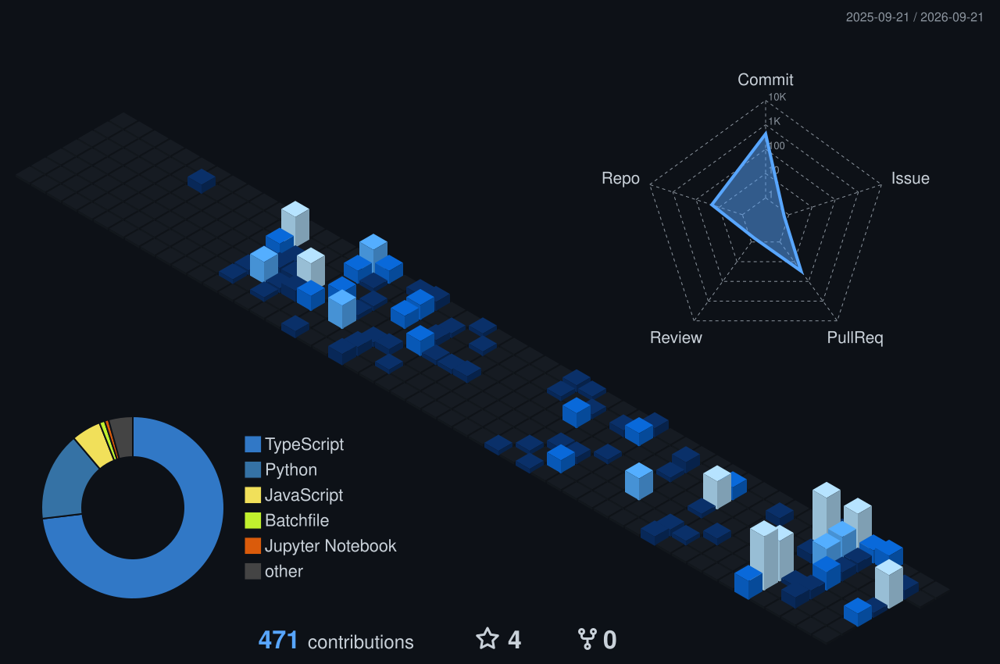

  

  

  
  
  

## Projets choisis

| Projet | Ce qu'il fait |
| :-- | :-- |
| **[AMVerge](https://github.com/AMVerge-team/AMVerge)** | Découpe rapide de scènes pour monteurs : import, détection, aperçu instantané et export. |
| **[AMV Notation](https://github.com/NetsumaInfo/application-bareme-amv-france)** | Application Windows pour noter et agréger les résultats de concours AMV. |
| **[NetsuShelf](https://github.com/NetsumaInfo/NetsuShelf)** | Transforme des romans web en EPUB, HTML, PDF ou TXT. |
| **[AMVerge-CLI](https://github.com/NetsumaInfo/AMVerge-CLI)** | Outil en ligne de commande et bibliothèque Python pour le traitement média. |

  

